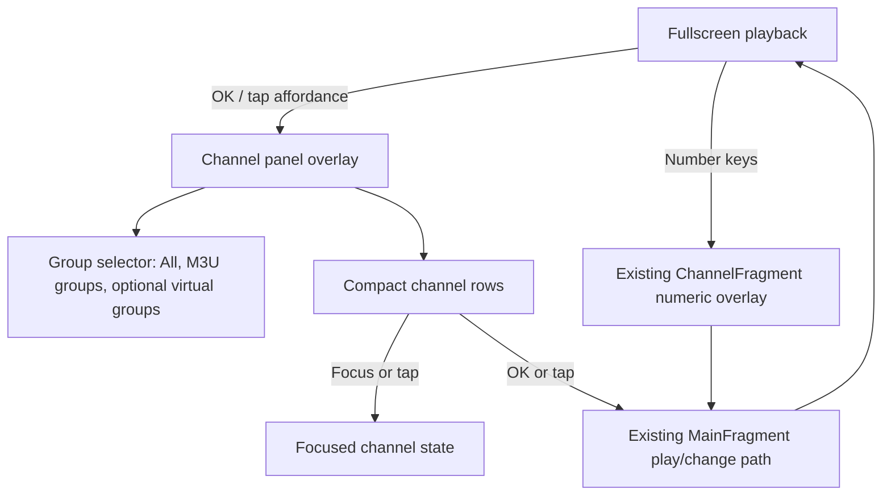

# feat: Add IPTV Channel Panel

## Overview

Replace the current video-card playlist surface with an IPTV-style channel overlay: playback stays full screen, TV users get a remote-friendly side panel, and phone users get a touch-friendly drawer. The plan preserves existing playback, numeric channel entry, remote playlist refresh, and settings behavior while changing how users browse and select channels.

## Problem Frame

The current channel UI is built around Leanback rows and image cards, which makes the app feel like a video browsing surface rather than live TV. The requirements call for a playback-first channel panel with compact numbered rows, group navigation, current-channel highlighting, and separate TV and phone ergonomics (see origin: `docs/brainstorms/2026-04-27-iptv-channel-list-requirements.md`).

## Requirements Trace

- R1-R4. Playback remains full screen while the channel panel overlays it and opens at the current channel.
- R5-R9. Channels are shown as compact numbered rows with playing/focus state and optional logo/EPG metadata.
- R10-R13. M3U groups remain available, with `All` and fallback grouping; favorites/recents are first-pass only if low-cost local state is available.
- R14-R18. TV remote interactions preserve direct channel switching and add focused panel navigation.
- R19-R22. Phone interactions use tap, tabs, scrolling, and tap-to-play rather than remote assumptions.
- R23-R25. Existing playback, playlist refresh, numeric entry, error handling, and current position continuity stay intact.

## Scope Boundaries

- No timeline-style EPG grid.
- No playlist parser rewrite unless a small compatibility fix is necessary for display metadata.
- No cloud sync, account state, or cross-device favorites.
- No advanced search in the first implementation.
- No playback engine redesign.

### Deferred to Separate Tasks

- Full EPG guide: future iteration after the basic IPTV channel panel is stable.
- Advanced search and filtering: future iteration if large playlist navigation still needs it.

## Context & Research

### Relevant Code and Patterns

- `app/src/main/java/com/gamaxtersnow/mytv/MainActivity.kt` owns fragment composition, remote key handling, touch gestures, hide timers, and playback entry points.
- `app/src/main/java/com/gamaxtersnow/mytv/MainFragment.kt` currently builds Leanback rows from `TVList.list`, observes channel changes, and exposes `play`, `prev`, `next`, and reload behavior.
- `app/src/main/java/com/gamaxtersnow/mytv/CardPresenter.kt` renders the current large card UI and should not be the pattern for the new channel rows.
- `app/src/main/java/com/gamaxtersnow/mytv/ChannelFragment.kt` handles numeric-entry display and should remain focused on that responsibility.
- `app/src/main/java/com/gamaxtersnow/mytv/TVList.kt` merges local and remote channels, preserves M3U group names, and assigns continuous ids.
- `app/src/main/java/com/gamaxtersnow/mytv/models/TVListViewModel.kt` and `app/src/main/java/com/gamaxtersnow/mytv/models/TVViewModel.kt` provide current channel state and per-channel EPG/video metadata.
- `app/src/main/res/layout/setting.xml` shows the project already uses custom XML layouts and view binding outside Leanback.

### Institutional Learnings

- No `docs/solutions/` learnings were found during planning.

### External References

- External research was skipped. The target behavior is defined by common IPTV interaction conventions and the repo already contains the relevant Android patterns for fragments, XML layouts, key handling, gestures, and view binding.

## Key Technical Decisions

- Build a custom overlay fragment instead of adapting the Leanback card grid: The required UI is a dense channel list with group navigation and phone-specific layout, which is a poor fit for the existing poster-card presenter.
- Keep channel selection behavior centralized through the existing `MainFragment.play`, `prev`, and `next` paths initially: This reduces playback regression risk while the browsing surface changes.
- Split channel-panel display from numeric-entry display: `ChannelFragment` should continue to show channel digits; the new panel should handle browsing and selection.
- Treat favorites/recents as conditional first-pass work: Add only if existing `SP` storage patterns can support them without expanding the release scope.

## Open Questions

### Resolved During Planning

- Whether to adapt Leanback cards or build a custom overlay: Build a custom overlay because compact IPTV rows and phone drawers are materially different from the current card browsing model.
- Whether EPG is required for every row: No. EPG is optional metadata because current coverage is partial.

### Deferred to Implementation

- Exact responsive breakpoint between TV side panel and phone drawer: Determine using available display metrics and resource qualifiers while implementing layouts.
- Exact visual dimensions and colors: Tune in implementation against screenshots so the overlay remains readable over video.
- Whether favorites/recents fit in the first pass: Confirm against existing `SP` patterns and keep it out if it adds persistence complexity.

## High-Level Technical Design

> *This illustrates the intended approach and is directional guidance for review, not implementation specification. The implementing agent should treat it as context, not code to reproduce.*

## Implementation Units

- [ ] **Unit 1: Channel Panel State Model**

**Goal:** Define the view state needed by the new panel without changing playback behavior.

**Requirements:** R4-R13, R23, R25

**Dependencies:** None

**Files:**
- Modify: `app/build.gradle`
- Modify: `app/src/main/java/com/gamaxtersnow/mytv/models/TVListViewModel.kt`
- Modify: `app/src/main/java/com/gamaxtersnow/mytv/models/TVViewModel.kt`
- Create: `app/src/test/java/com/gamaxtersnow/mytv/models/ChannelPanelStateTest.kt`

**Approach:**
- Add a small state/query layer that can produce grouped channel rows from the existing `TVList.list` and `TVViewModel` data.
- Add minimal local unit test dependencies if the project does not already have them.
- Preserve continuous channel ids as the source for display numbers.
- Include `All` and fallback grouping in the derived state.
- Carry current playing id separately from focused id so the UI can style them independently.

**Execution note:** Implement state derivation test-first because it is the easiest place to lock down grouping, numbering, and current-channel behavior without UI fragility.

**Patterns to follow:**
- Existing lightweight state methods in `TVListViewModel`.
- Existing channel metadata access through `TVViewModel.getTV()`.

**Test scenarios:**
- Happy path: Given two M3U groups with multiple channels, deriving panel state returns `All` plus the original groups with stable display numbers.
- Happy path: Given a current channel id, the derived row for that channel is marked as currently playing.
- Edge case: Given an empty or blank group title, the channel appears under the fallback group.
- Edge case: Given a current channel id no longer present after refresh, the state falls back to the first playable channel.

**Verification:**
- Channel grouping and display numbering are deterministic and do not require playback to be running.

- [ ] **Unit 2: Custom Channel Panel Fragment and Layouts**

**Goal:** Add the playback overlay UI that displays group navigation and compact channel rows for TV and phone layouts.

**Requirements:** R1-R13, R18-R22

**Dependencies:** Unit 1

**Files:**
- Modify: `app/build.gradle`
- Create: `app/src/main/java/com/gamaxtersnow/mytv/ChannelPanelFragment.kt`
- Create: `app/src/main/res/layout/channel_panel.xml`
- Create: `app/src/main/res/layout/channel_panel_row.xml`
- Create or modify: `app/src/main/res/drawable/*`
- Modify: `app/src/main/res/values/colors.xml`
- Test: `app/src/androidTest/java/com/gamaxtersnow/mytv/ChannelPanelFragmentTest.kt`

**Approach:**
- Add minimal Android instrumentation test dependencies if the project does not already have them.
- Use XML layouts and view binding consistent with existing fragments.
- Render TV landscape as a side panel with group selector and channel list.
- Render phone/portrait as a bottom drawer or drawer-like overlay using the same row content.
- Keep row content dense: number, logo when available, channel name, optional current program, playing marker.
- Do not reuse `CardPresenter`; it is intentionally a different UI pattern.

**Patterns to follow:**
- Fragment/view binding setup from `ChannelFragment` and `SettingFragment`.
- Existing rounded/dark overlay drawable patterns in `app/src/main/res/drawable`.

**Test scenarios:**
- Happy path: Opening the panel renders groups and channel rows from provided state.
- Happy path: The current playing row and focused row can be visually represented at the same time.
- Edge case: Rows without logos or EPG still render with channel number and name.
- Integration: On a phone-sized configuration, the channel list uses the touch layout rather than the TV side-panel arrangement.

**Verification:**
- The overlay is readable over video and does not replace the playback fragment.

- [ ] **Unit 3: Main Activity Integration and Remote Navigation**

**Goal:** Wire the panel into existing fragment composition and remote key handling while preserving direct channel switching.

**Requirements:** R1, R4, R14-R18, R23-R25

**Dependencies:** Units 1 and 2

**Files:**
- Modify: `app/src/main/java/com/gamaxtersnow/mytv/MainActivity.kt`
- Modify: `app/src/main/java/com/gamaxtersnow/mytv/MainFragment.kt`
- Test: `app/src/androidTest/java/com/gamaxtersnow/mytv/MainActivityChannelPanelTest.kt`

**Approach:**
- Add the channel panel fragment to the same overlay stack as the existing fragments.
- Change OK/center behavior so playback mode opens the panel and panel mode selects or closes according to focus state.
- Keep up/down and channel up/down as direct switching while the panel is closed.
- Route panel selection back through existing `play(itemPosition)` or channel-change paths to minimize playback behavior changes.
- Ensure Back closes the panel before applying app-level back behavior.
- Keep existing numeric-entry key handling and `ChannelFragment` behavior unchanged.

**Patterns to follow:**
- Existing fragment show/hide methods and hide timers in `MainActivity`.
- Existing `mainFragment.play`, `prev`, and `next` behavior.

**Test scenarios:**
- Happy path: With the panel closed, channel up/down switches channels exactly as before.
- Happy path: Pressing OK during playback opens the panel at the current channel.
- Happy path: With the panel open, up/down moves focus, left/right changes groups, OK plays the focused channel, and Back closes the panel.
- Edge case: Selecting a channel with no playable URL surfaces the existing error behavior instead of silently dismissing all UI.
- Integration: Numeric key entry still displays the existing channel number overlay and starts playback.

**Verification:**
- Remote-only users can open the list, switch channels, close the list, and continue watching without touching playback engine code.

- [ ] **Unit 4: Phone Touch Flow**

**Goal:** Make the channel panel efficient on phones without weakening TV remote behavior.

**Requirements:** R3, R19-R22, R23

**Dependencies:** Units 1-3

**Files:**
- Modify: `app/src/main/java/com/gamaxtersnow/mytv/MainActivity.kt`
- Modify: `app/src/main/java/com/gamaxtersnow/mytv/ChannelPanelFragment.kt`
- Test: `app/src/androidTest/java/com/gamaxtersnow/mytv/PhoneChannelPanelFlowTest.kt`

**Approach:**
- Preserve current single-tap control behavior, but add an explicit channel-list affordance when touch controls are visible.
- Use horizontal group tabs and vertical channel rows for phone interaction.
- Close or collapse the drawer after selecting a channel.
- Avoid TV-only focus assumptions in phone mode.

**Patterns to follow:**
- Existing `GestureDetector` handling in `MainActivity`.
- Existing setting dialog auto-hide behavior for inactivity management.

**Test scenarios:**
- Happy path: Single tap reveals controls and the channel affordance opens the drawer.
- Happy path: Tapping a group tab changes visible channels.
- Happy path: Tapping a channel starts playback and closes or collapses the drawer.
- Edge case: Tapping outside or pressing Back closes the drawer without changing channels.

**Verification:**
- Phone users can switch channels with tap and scroll, without relying on DPAD focus.

- [ ] **Unit 5: Visual Polish, Accessibility, and Regression Coverage**

**Goal:** Finalize readability, focus behavior, and regression protection for the new playlist experience.

**Requirements:** R1-R25

**Dependencies:** Units 1-4

**Files:**
- Modify: `app/src/main/res/layout/channel_panel.xml`
- Modify: `app/src/main/res/layout/channel_panel_row.xml`
- Modify: `app/src/main/res/values/strings.xml`
- Modify: `app/src/main/res/values/styles.xml`
- Test: `app/src/androidTest/java/com/gamaxtersnow/mytv/ChannelPanelRegressionTest.kt`

**Approach:**
- Tune text sizes, row heights, contrast, and selected/playing states for TV distance and phone touch use.
- Add content descriptions where icons or logos affect understanding.
- Validate long channel names and missing metadata.
- Ensure inactivity hiding does not interrupt active remote navigation.

**Patterns to follow:**
- Existing string resource usage in `app/src/main/res/values/strings.xml`.
- Existing dark overlay styling from settings and channel-number overlays.

**Test scenarios:**
- Happy path: Long channel names do not overlap status or EPG text.
- Edge case: Missing logo, missing EPG, and long M3U group names remain usable.
- Integration: Auto-hide hides an idle panel but does not hide during active navigation.
- Integration: Playlist refresh while the panel is open keeps a valid current or fallback selection.

**Verification:**
- The UI reads as an IPTV/live TV list rather than a media-card gallery across TV and phone screen sizes.

## System-Wide Impact

- **Interaction graph:** `MainActivity` key/touch events will route to the new panel when it is visible; playback still flows through `MainFragment` and `PlayerFragment`.
- **Error propagation:** Channel selection should continue to use existing `check`, toast, and error fragment behavior for invalid or failed playback.
- **State lifecycle risks:** Playlist refresh can invalidate focused ids; panel state must recover to the current channel or first playable channel.
- **API surface parity:** Remote control, touch, and numeric-key channel selection must all reach the same playback selection behavior.
- **Integration coverage:** Remote navigation and phone touch flows need instrumentation or manual device verification because unit tests cannot prove focus and overlay behavior alone.
- **Unchanged invariants:** Remote M3U loading, cache refresh, numeric-entry selection, playback engine selection, and settings persistence remain unchanged.

## Risks & Dependencies

| Risk | Mitigation |
|------|------------|
| Focus handling regresses on Android TV remotes | Keep remote navigation tests/manual verification explicit and isolate panel key handling from direct channel switching. |
| Custom overlay duplicates too much `MainFragment` behavior | Keep playback selection routed through existing `MainFragment` APIs during the first pass. |
| Phone drawer and TV side panel diverge behaviorally | Share the same derived channel state and row selection callbacks. |
| Favorites/recents expand scope | Treat them as optional first-pass virtual groups and defer if persistence is not already trivial. |
| Sparse EPG makes rows look inconsistent | Make EPG optional and reserve stable space only when it improves readability. |

## Documentation / Operational Notes

- Update user-facing release notes or README only after implementation, if the app documents remote-control behavior.
- Manual verification should include at least one TV/landscape device and one phone/portrait device.

## Sources & References

- **Origin document:** [docs/brainstorms/2026-04-27-iptv-channel-list-requirements.md](docs/brainstorms/2026-04-27-iptv-channel-list-requirements.md)
- Related code: `app/src/main/java/com/gamaxtersnow/mytv/MainActivity.kt`
- Related code: `app/src/main/java/com/gamaxtersnow/mytv/MainFragment.kt`
- Related code: `app/src/main/java/com/gamaxtersnow/mytv/TVList.kt`
- Related code: `app/src/main/java/com/gamaxtersnow/mytv/ChannelFragment.kt`
